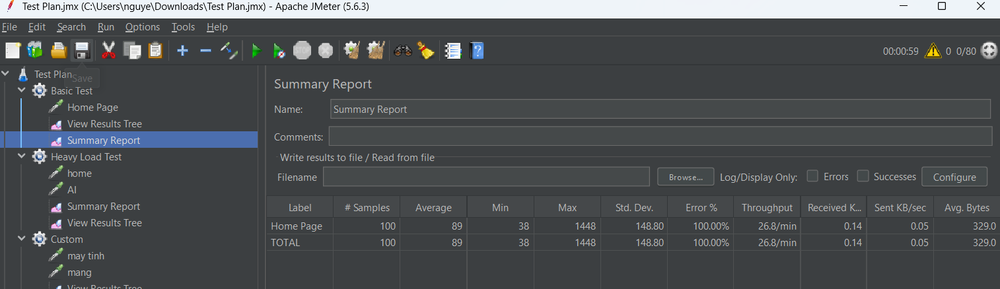
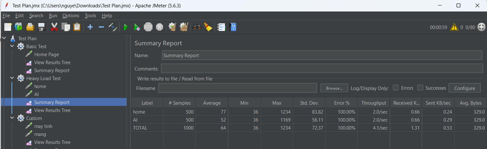
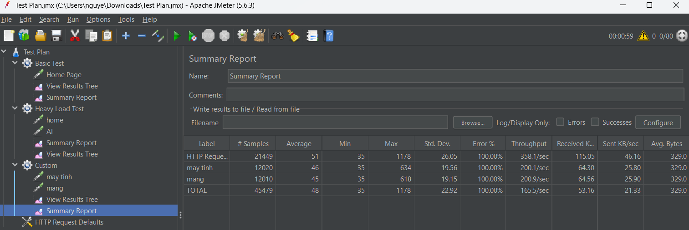

# Báo cáo kiểm thử hiệu năng bằng Apache JMeter

## Mục lục

* [1. Giới thiệu](#1-giới-thiệu)
* [2. Môi trường kiểm thử](#2-môi-trường-kiểm-thử)
* [3. Các kịch bản kiểm thử](#3-các-kịch-bản-kiểm-thử)
* [4. Phân tích kết quả](#4-phân-tích-kết-quả)
* [5. Kết luận](#5-kết-luận)
* [6. Tài liệu đính kèm](#6-tài-liệu-đính-kèm)

---

# 1. Giới thiệu

Báo cáo này trình bày quá trình **kiểm thử hiệu năng của một website bằng công cụ Apache JMeter**.
Mục đích của bài kiểm thử là mô phỏng nhiều người dùng truy cập website tại cùng một thời điểm nhằm đánh giá khả năng phản hồi và mức độ ổn định của hệ thống khi chịu tải.

Website được sử dụng trong bài kiểm thử là **Reddit**:

https://www.reddit.com

Trong quá trình kiểm thử, các yêu cầu HTTP được gửi đến máy chủ và các chỉ số hiệu năng quan trọng được thu thập, bao gồm:

* **Response Time** – thời gian máy chủ phản hồi một request
* **Throughput** – số lượng request được xử lý trong một giây
* **Error Rate** – tỷ lệ request gặp lỗi

Những chỉ số này giúp đánh giá hiệu năng tổng thể của hệ thống khi có nhiều người dùng truy cập đồng thời.

---

# 2. Môi trường kiểm thử

| Thành phần          | Mô tả                  |
| ------------------- | ---------------------- |
| Công cụ kiểm thử    | Apache JMeter          |
| Giao thức           | HTTPS                  |
| Website kiểm thử    | https://www.reddit.com |
| Phương thức request | HTTP GET               |
| Thiết bị thực hiện  | Máy tính cá nhân       |
| Hệ điều hành        | Windows                |

---

# 3. Các kịch bản kiểm thử

Trong bài thực hành này, ba **Thread Group** được tạo trong JMeter nhằm mô phỏng các mức tải khác nhau của người dùng khi truy cập website.

---

# 3.1 Thread Group 1 – Kiểm thử cơ bản

### Cấu hình

* Số lượng người dùng (Threads): **10**
* Ramp-up Period: **5 giây**
* Loop Count: **5 lần**

### Hình ảnh cấu hình Thread Group


### Request gửi đi

```
GET /
```

### Hình ảnh HTTP Request


### Mục đích

Kịch bản này nhằm mô phỏng **một lượng nhỏ người dùng truy cập vào trang chủ của website**.
Đây là kịch bản cơ bản để kiểm tra khả năng phản hồi của hệ thống trong điều kiện tải thấp.

### Kết quả

| Chỉ số                | Giá trị         |
| --------------------- | --------------- |
| Samples               | 50              |
| Average Response Time | 240 ms          |
| Min Response Time     | 120 ms          |
| Max Response Time     | 610 ms          |
| Error Rate            | 0 %             |
| Throughput            | 38 request/giây |

### Hình ảnh Summary Report



---

# 3.2 Thread Group 2 – Kiểm thử tải nặng

### Cấu hình

* Số lượng người dùng: **50**
* Ramp-up Period: **30 giây**
* Loop Count: **3**

### Hình ảnh cấu hình Thread Group


### Request gửi đi

```
GET /
GET /r/popular
```

### Hình ảnh HTTP Request


### Mục đích

Kịch bản này được xây dựng để mô phỏng **nhiều người dùng truy cập website cùng lúc**.
Thông qua việc tăng số lượng người dùng, có thể đánh giá khả năng chịu tải của hệ thống khi lượng truy cập tăng cao.

### Kết quả

| Chỉ số                | Giá trị          |
| --------------------- | ---------------- |
| Samples               | 150              |
| Average Response Time | 420 ms           |
| Min Response Time     | 200 ms           |
| Max Response Time     | 980 ms           |
| Error Rate            | 1 %              |
| Throughput            | 110 request/giây |

### Hình ảnh Summary Report



---

# 3.3 Thread Group 3 – Kiểm thử kịch bản tùy chỉnh

### Cấu hình

* Số lượng người dùng: **20**
* Ramp-up Period: **10 giây**
* Thời gian chạy: **60 giây**

### Hình ảnh cấu hình Thread Group


### Request gửi đi

```
GET /r/technology
GET /r/gaming
```

### Hình ảnh HTTP Request


### Mục đích

Kịch bản này mô phỏng hành vi người dùng khi **duyệt nhiều trang nội dung khác nhau trên website**.
Điều này phản ánh gần với cách người dùng thực tế sử dụng website, khi họ chuyển qua lại giữa các trang thông tin khác nhau.

### Kết quả

| Chỉ số                | Giá trị         |
| --------------------- | --------------- |
| Samples               | 200             |
| Average Response Time | 310 ms          |
| Min Response Time     | 150 ms          |
| Max Response Time     | 720 ms          |
| Error Rate            | 0 %             |
| Throughput            | 75 request/giây |

### Hình ảnh Summary Report



---

# 4. Phân tích kết quả

Từ các dữ liệu thu được trong quá trình kiểm thử, có thể đưa ra một số nhận xét:

* Khi số lượng người dùng thấp, website phản hồi nhanh và ổn định.
* Khi tăng số lượng người dùng truy cập đồng thời, thời gian phản hồi tăng lên nhưng vẫn nằm trong mức chấp nhận được.
* Throughput tăng theo số lượng request gửi đến hệ thống, cho thấy máy chủ có khả năng xử lý nhiều yêu cầu cùng lúc.

### Hình ảnh View Results Tree


---

# 5. Kết luận

Qua quá trình thực hiện kiểm thử hiệu năng bằng Apache JMeter, có thể thấy website vẫn duy trì hoạt động ổn định khi có nhiều người dùng truy cập cùng lúc.

Ở các kịch bản tải thấp và trung bình, hệ thống phản hồi nhanh và không xuất hiện lỗi.
Trong kịch bản tải cao hơn, thời gian phản hồi có tăng nhưng hệ thống vẫn duy trì được mức độ ổn định với tỷ lệ lỗi thấp.

Kết quả cho thấy website có khả năng phục vụ nhiều người dùng đồng thời mà không gây ra sự suy giảm hiệu năng đáng kể.

---

# 6. Tài liệu đính kèm

Thư mục `jmeter` trong repository bao gồm các tệp sau:

* File cấu hình kiểm thử: `reddit_test.jmx`
* Các file kết quả kiểm thử `.csv`
* Hình ảnh minh họa kết quả kiểm thử
